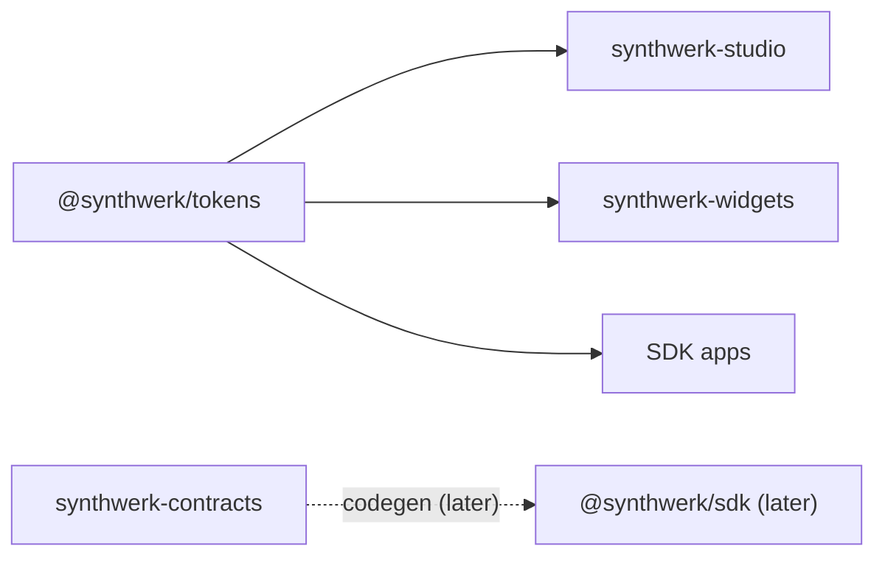

<!-- Synthwerk README skeleton (D-16). Banner: interim logo until synthwerk/tools/banner.py exists. -->
<picture>
  <source media="(prefers-color-scheme: dark)" srcset="packages/tokens/assets/synthwerk-logo-dark.svg">
  
</picture>

[](https://github.com/VelimirMueller/synthwerk-sdk/actions/workflows/ci.yml)
[](https://github.com/VelimirMueller/synthwerk-sdk/releases)
[](LICENSE)
[](https://github.com/VelimirMueller/synthwerk-contracts)

## In 30 seconds

- One pnpm workspace for the `@synthwerk/*` npm packages: SDK, framework adapters and design packages.
- Studio, widgets and SDK apps import the packages. The repo calls no service at build time.
- The first package is `@synthwerk/tokens`: 2 themes × 2 modes, 19 semantic colours, 2.7 KB gzip CSS.

## Where it fits



- Ecosystem map: [synthwerk](https://github.com/VelimirMueller/synthwerk).

## Quick start

```sh
corepack enable
pnpm install
pnpm check      # biome ci · tsc --noEmit · vitest run · build
pnpm --filter @synthwerk/tokens demo         # demo page on http://127.0.0.1:4173/demo/
pnpm --filter @synthwerk/tokens screenshots  # theme checks in Chromium + PNGs in ./screenshots
```

## API and events

- No HTTP API and no events. The repo ships npm packages.

| Package | Exports | Status |
|---|---|---|
| [`@synthwerk/tokens`](packages/tokens) | `.` (typed data, `resolveMode`, `contrastRatio`, `firstPaintScript`), `./tokens.css`, `./tailwind.css`, `./tokens.json`, `./assets/*` | 0.1.0, not published |

## Configuration

| Variable | Required | Use |
|---|---|---|
| None. | | |

## Development

```text
packages/tokens/
├─ src/          tokens.ts (single source) · css.ts (renderers) · theme.ts · contrast.ts
├─ scripts/      build.ts · outline-wordmark.ts · serve.ts · screenshots.ts
├─ assets/       logo, wordmark and mark SVGs (light + dark, text outlined)
└─ demo/         static demo page with a theme and mode switch
tests/unit/tokens/   contrast, CSS structure, token layers, theme rules, assets
tools/biome-config/  vendored copy of @synthwerk/biome-config (see its README)
```

| Level | Folder | Command |
|---|---|---|
| unit | `tests/unit/` | `pnpm test` |

- Lint and format: Biome 2.5 (D-06). Run `pnpm format` before a commit.
- TypeScript 6.0.3 for now. The SDK core moves to TS 7 when it starts (synthwerk-sdk §3.1).
- Node 24 runs the `.ts` scripts directly (type stripping). No `tsx` needed.

### Fonts (self-host, SIL OFL 1.1)

- The package does not bundle font files. Apps self-host them (no Google Fonts at runtime: GDPR, CSP).
- Get the files from the official sources: [google/fonts `ofl/spacegrotesk`](https://github.com/google/fonts/tree/main/ofl/spacegrotesk), [`ofl/inter`](https://github.com/google/fonts/tree/main/ofl/inter), [`ofl/jetbrainsmono`](https://github.com/google/fonts/tree/main/ofl/jetbrainsmono).
- Subset to Latin + Latin-1 Supplement and convert to `woff2` (for example `pyftsubset --flavor=woff2 --unicodes=U+0000-00FF`).
- Ship each font's `OFL.txt` next to its `woff2` files. The OFL requires the licence text with the font.
- Declare `@font-face` with `font-display: swap`. Preload one file only (Inter variable).
- Family names must match the stacks in `tokens.ts`: `Space Grotesk`, `Inter`, `JetBrains Mono`.

### Wordmark

- `pnpm --filter @synthwerk/tokens wordmark` outlines "synthwerk" in Space Grotesk Bold (weight 700).
- The script downloads the variable font from google/fonts, pinned by commit and SHA-256, into `.cache/` (git-ignored).
- Only the outlined paths go into `assets/`. No font binary is committed.

## Roadmap

| Package | Epic | Content |
|---|---|---|
| `@synthwerk/tokens` | E0/E1 | This release. Next: `patterns.css`, `oklch()` output. |
| `@synthwerk/sdk` | E2 | Core client generated from synthwerk-contracts, auth modes, query keys. |
| `@synthwerk/vue` | E2 | Vue 3.5 adapter. |
| `@synthwerk/ui-vue` | E1/E4 | UX pattern library (Vue). |
| `@synthwerk/react`, `@synthwerk/ui-react` | E7 | React adapter and patterns. |
| `create-synthwerk-app` | E7 | App scaffolder (React default, Vue option). |

## Deploy

- No deploy. Packages go to npmjs.com under `@synthwerk` with changesets and provenance (D-24), after the npm org exists.

## Features

<!-- One row per docs/features/*.md. /feature-doc keeps this table current. -->

| Feature | Status |
|---|---|
| [Brand tokens](docs/features/brand-tokens.md) | beta |

## Security

- Report a vulnerability through GitHub private vulnerability reporting on this repo.

## License

- [MIT](LICENSE)
