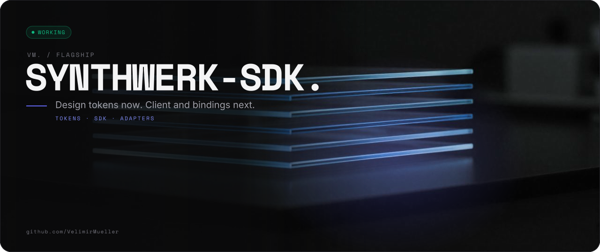
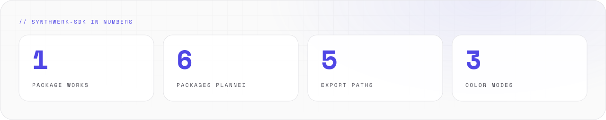
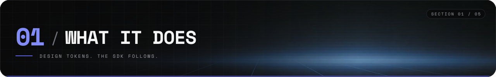
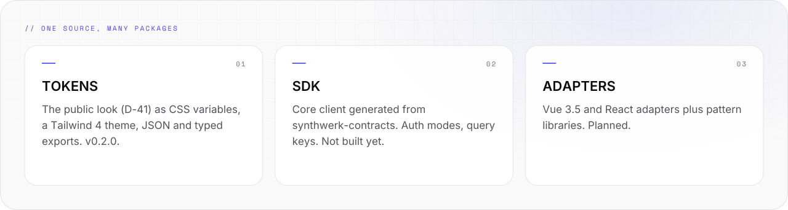
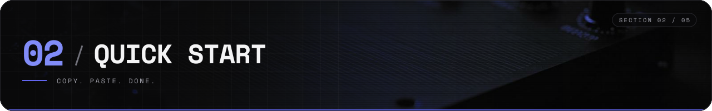
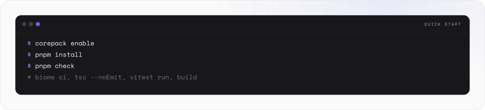
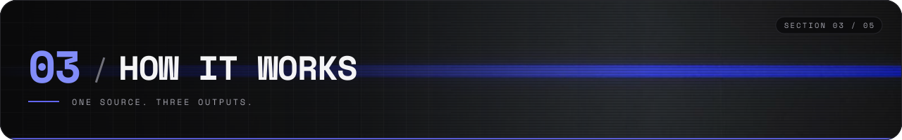
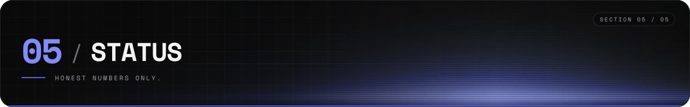
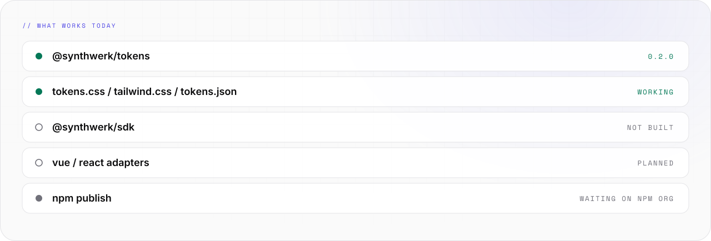

<picture>
  <source media="(prefers-color-scheme: light)" srcset="assets/banner/hero-v2-light.svg">
  
</picture>

<p align="center">

[](#-05-status) [](https://github.com/VelimirMueller) [](packages/tokens) [](#-04-usage)

</p>

> Design tokens now. Client and bindings next.

```text
 █████  ██  ██  ██  ██  ██████  ██  ██  ██   ██  ██████  █████   ██  ██
██      ██  ██  ███ ██    ██    ██  ██  ██   ██  ██      ██  ██  ██ ██
 ████    ████   ██████    ██    ██████  ██ █ ██  █████   █████   ████    █████
    ██    ██    ██ ███    ██    ██  ██  ███████  ██      ██ ██   ██ ██
█████     ██    ██  ██    ██    ██  ██   ██ ██   ██████  ██  ██  ██  ██
 █████  █████   ██  ██
██      ██  ██  ██ ██
 ████   ██  ██  ████
    ██  ██  ██  ██ ██
█████   █████   ██  ██  ██

 ------  npm packages for synthwerk apps  -----------------------
```

**synthwerk-sdk** holds the `@synthwerk/*` npm packages. Studio, widgets and SDK apps import them.
The first package is the design tokens. The rest is a plan. The plan is detailed.

<picture>
  <source media="(prefers-color-scheme: dark)" srcset="assets/readme/stats-v2-dark.svg">
  
</picture>

<br>

## // 01 WHAT IT DOES



<picture>
  <source media="(prefers-color-scheme: dark)" srcset="assets/readme/features-v2-dark.svg">
  
</picture>

- One pnpm workspace for the `@synthwerk/*` packages: SDK, framework adapters and design packages.
- `@synthwerk/tokens` is the public look (D-41) as CSS variables, a Tailwind 4 theme, JSON and typed exports.
- Run `pnpm install && pnpm check`. The repo calls no service at build time.
- Tokens work. The SDK, the adapters and the UI packages do not exist yet. Nothing is on npm yet.

<br>

## // 02 QUICK START



<picture>
  <source media="(prefers-color-scheme: dark)" srcset="assets/readme/start-v2-dark.svg">
  
</picture>

```bash
corepack enable
pnpm install
pnpm check      # biome ci, tsc --noEmit, vitest run, build
pnpm --filter @synthwerk/tokens demo         # demo page on http://127.0.0.1:4173/demo/
pnpm --filter @synthwerk/tokens screenshots  # theme checks in Chromium + PNGs in ./screenshots
```

In an app, import the CSS after Tailwind:

```css
@import "tailwindcss";
@import "@synthwerk/tokens/tokens.css";
@import "@synthwerk/tokens/tailwind.css";
```

<br>

## // 03 HOW IT WORKS



<picture>
  <source media="(prefers-color-scheme: dark)" srcset="assets/readme/flow-v2-dark.svg">
   OUTPUTS -> APPS. themes default + contrast. modes light, dark, system." src="assets/readme/flow-v2-light.svg" width="100%">
</picture>

```text
  src/tokens.ts   one source: primitive > semantic > component > service
      |
      v
  +------------+      +--------------+      +-------------+
  | tokens.css |      | tailwind.css |      | tokens.json |
  | CSS vars   |      | Tailwind map |      | hex values  |
  +-----+------+      +------+-------+      +------+------+
        |                    |                     |
        +========+===========+===========+=========+
                         |
                   studio · widgets · SDK apps

  themes   default (website + dashboard look) · contrast (AAA)
  modes    light · dark · system (default: follow the OS)
```

- Ecosystem map: [synthwerk](https://github.com/VelimirMueller/synthwerk).

<br>

## // 04 USAGE


### Packages

- [`@synthwerk/tokens`](packages/tokens): exports `.` (typed data, `resolveMode`, `contrastRatio`, `firstPaintScript`), `./tokens.css`, `./tailwind.css`, `./tokens.json`, `./assets/*`. 0.2.0, not published.

### Configuration

- None. The repo ships npm packages, not a running service.

### API and events

- No HTTP API and no events. Service APIs live in [synthwerk-contracts](https://github.com/VelimirMueller/synthwerk-contracts).

### Development

- Lint and format: Biome 2.5 (D-06). Run `pnpm format` before a commit.
- TypeScript 6.0.3 for now. The SDK core moves to TS 7 when it starts.
- Node 24 runs the `.ts` scripts directly (type stripping). No `tsx` needed.
- Unit tests live in `tests/unit/`. Run `pnpm test`.
- Blueprint: [synthwerk-blueprint](https://github.com/VelimirMueller/synthwerk-blueprint).
- The full layout, fonts, logo and roadmap are in [docs/REFERENCE.md](docs/REFERENCE.md).

<br>

## // 05 STATUS



<picture>
  <source media="(prefers-color-scheme: dark)" srcset="assets/readme/status-v2-dark.svg">
  
</picture>

```text
[ STATUS ]  in development, M0
[ WORKS  ]  @synthwerk/tokens 0.2.0
[ NEXT   ]  @synthwerk/sdk from contracts
```

Run the whole check:

```bash
pnpm check   # biome ci, tsc --noEmit, vitest run, build
```

- Feature doc: [Brand tokens](docs/features/brand-tokens.md) (beta). Changes: [CHANGELOG.md](CHANGELOG.md).

<br>

```text
-- EOF ------------------------------------------ TOKENS ARE NOT VIBES --
```

---

<sub>VM. studio / flagship · open source · look per <code>vm-brand</code> playbook · [MIT](LICENSE) © 2026 Velimir Mueller</sub>
