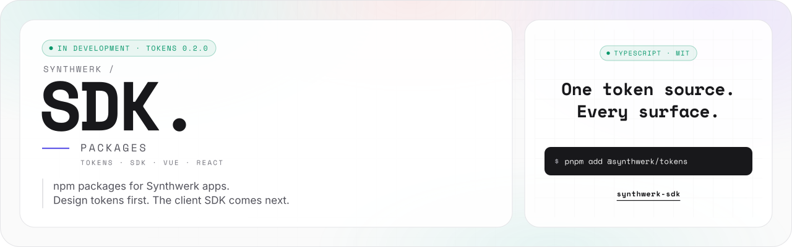

<picture>
  <source media="(prefers-color-scheme: dark)" srcset="assets/banner/banner-v1-dark.svg">
  
</picture>

<p align="center">
  
  
  <a href="LICENSE"></a>
</p>

**synthwerk-sdk** holds the `@synthwerk/*` npm packages. Studio, widgets and SDK apps import them.

```text
[ STATUS ]  in development, M0
[ WORKS  ]  @synthwerk/tokens 0.2.0
[ NEXT   ]  @synthwerk/sdk from contracts
```

## In 30 seconds

- One pnpm workspace for the `@synthwerk/*` packages: SDK, framework adapters and design packages.
- The first package is `@synthwerk/tokens`: the public look (D-41) as CSS variables, a Tailwind 4 theme, JSON and typed exports.
- Run `pnpm install && pnpm check`. The repo calls no service at build time.
- Status: tokens work. The SDK, the adapters and the UI packages do not exist yet. Nothing is on npm yet.

## How it works

```text
-- 02 ---------------------------------------------------- HOW IT WORKS --

  src/tokens.ts  (one source: primitive > semantic > component > service)
        |
        v
  +----------------+   +------------------+   +--------------+
  |   tokens.css   |   |   tailwind.css   |   |  tokens.json |
  |  CSS variables |   |  Tailwind 4 map  |   |  hex values  |
  +-------+--------+   +--------+---------+   +------+-------+
          |                     |                    |
          +=========+===========+==========+=========+
                    |                      |
               +----v-----+          +-----v------+     +-----------+
               |  studio  |          |  widgets   |     | SDK apps  |
               +----------+          +------------+     +-----------+

  themes   default (website + dashboard look) . contrast (AAA)
  modes    light . dark . system (default: follow the OS)
```

- Ecosystem map: [synthwerk](https://github.com/VelimirMueller/synthwerk).

## Quick start

```sh
corepack enable
pnpm install
pnpm check      # biome ci, tsc --noEmit, vitest run, build
pnpm --filter @synthwerk/tokens demo         # demo page on http://127.0.0.1:4173/demo/
pnpm --filter @synthwerk/tokens screenshots  # theme checks in Chromium + PNGs in ./screenshots
```

```css
@import "tailwindcss";
@import "@synthwerk/tokens/tokens.css";
@import "@synthwerk/tokens/tailwind.css";
```

## Configuration

| Variable | Required | Use |
|---|---|---|
| None. | | |

## API and events

- No HTTP API and no events. The repo ships npm packages. Service APIs live in [synthwerk-contracts](https://github.com/VelimirMueller/synthwerk-contracts).

| Package | Exports | Status |
|---|---|---|
| [`@synthwerk/tokens`](packages/tokens) | `.` (typed data, `resolveMode`, `contrastRatio`, `firstPaintScript`), `./tokens.css`, `./tailwind.css`, `./tokens.json`, `./assets/*` | 0.2.0, not published |

## Development

```text
packages/tokens/
  src/        tokens.ts (single source), css.ts (renderers), theme.ts, contrast.ts
  scripts/    build.ts, fonts.ts, outline-wordmark.ts, serve.ts, screenshots.ts
  assets/     SYNTHWERK. logo, wordmark, S. mark (light + dark), favicon
  demo/       static demo page with a theme and mode switch
tests/unit/tokens/   contrast, CSS structure, token layers, theme rules, assets
tools/biome-config/  vendored copy of @synthwerk/biome-config (see its README)
assets/banner/       README banner (synthwerk/scripts/make-banner.py)
```

| Level | Folder | Command |
|---|---|---|
| unit | `tests/unit/` | `pnpm test` |

- Lint and format: Biome 2.5 (D-06). Run `pnpm format` before a commit.
- TypeScript 6.0.3 for now. The SDK core moves to TS 7 when it starts.
- Node 24 runs the `.ts` scripts directly (type stripping). No `tsx` needed.

### Fonts (self-host, SIL OFL 1.1)

| Token | Font | Use |
|---|---|---|
| `--font-display` | Space Mono 400, 700 | Headlines, wordmark, labels, pills |
| `--font-sans` | Inter 400, 600 | Body text and controls |
| `--font-mono` | JetBrains Mono 400, 700 | Code, logs, diffs |

- The package does not bundle font files. Apps self-host them (no Google Fonts at runtime: GDPR, CSP).
- `pnpm --filter @synthwerk/tokens fonts` fetches the pinned files from google/fonts (commit + SHA-256) into `.cache/` (git-ignored). The demo uses them.
- Subset to Latin + Latin-1 Supplement and convert to `woff2` (for example `pyftsubset --flavor=woff2 --unicodes=U+0000-00FF`).
- Ship each font's `OFL.txt` next to its `woff2` files. Declare `@font-face` with `font-display: swap`.

### Logo

- `pnpm --filter @synthwerk/tokens wordmark` outlines `SYNTHWERK.` and the `S.` mark in Space Mono Bold.
- Only outlined paths go into `assets/`. No font binary is committed.
- The README banner comes from the overview repo: `python3 scripts/make-banner.py --repo sdk --version v1 --out <this repo>/assets`.

## Roadmap

```text
-- 06 --------------------------------------------------------- ROADMAP --

  tokens 0.1  -->  tokens 0.2  -->  sdk core  -->  vue  -->  react
  (neon v1)       (public look)     (E2)         (E2)      (E7)
                       ^
                      now
```

| Package | Epic | Content |
|---|---|---|
| `@synthwerk/tokens` | E0/E1 | 0.2.0: public look (D-41). Next: `patterns.css`, `oklch()` output. |
| `@synthwerk/sdk` | E2 | Core client generated from synthwerk-contracts, auth modes, query keys. |
| `@synthwerk/vue` | E2 | Vue 3.5 adapter. |
| `@synthwerk/ui-vue` | E1/E4 | UX pattern library (Vue). |
| `@synthwerk/react`, `@synthwerk/ui-react` | E7 | React adapter and patterns. |
| `create-synthwerk-app` | E7 | App scaffolder (React default, Vue option). |

## Docs

- Feature docs: [Brand tokens](docs/features/brand-tokens.md) (beta).
- Changes: [CHANGELOG.md](CHANGELOG.md).
- Blueprint: [synthwerk-blueprint](https://github.com/VelimirMueller/synthwerk-blueprint). Overview: [synthwerk](https://github.com/VelimirMueller/synthwerk).
- Deploy: no deploy. Packages go to npmjs.com under `@synthwerk` with changesets and provenance (D-24), after the npm org exists.
- Security: report a vulnerability through GitHub private vulnerability reporting on this repo.

## Features

<!-- One row per docs/features/*.md. /feature-doc keeps this table current. -->

| Feature | Status |
|---|---|
| [Brand tokens](docs/features/brand-tokens.md) | beta |

```text
 █████  █████   ██  ██
██      ██  ██  ██ ██
 ████   ██  ██  ████
    ██  ██  ██  ██ ██
█████   █████   ██  ██  ██
```

[MIT](LICENSE) © 2026 Velimir Mueller
